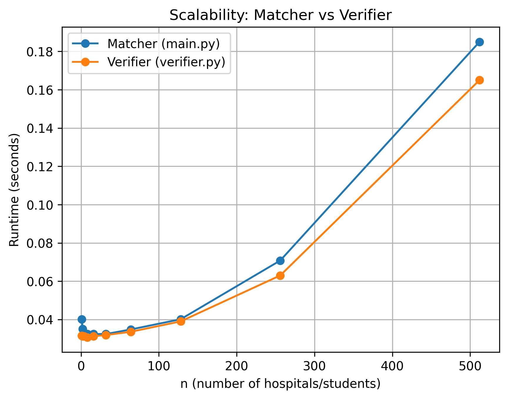

Aidan Boudreau (UFID:22043059)

## PLEASE NOTE
As per notice by a TA, my original group had been disolved. I am unsure if this was done by request of my group partner, or what may have caused it, but I had already begun working on the assignment and using a lot of his starting work to work on the part we agreed I would complete. Since the dissolvement I have redone all of his work, but his name is mentioned as a collaborator because I had originally bagan working prior to the group had been dissolved. 

## Instructions (Gale-Shapley Algorithm)
1. change input to a scenario in need of matching
2. run matching.py
3. read output in output.txt

## Input Format:
- **Line 1:**
first line: integer n, number of hospitals (proposal group) and students (accept/deny group)
- **next n lines:**
n lines: hospitals listing preffered students in decreasing order with space in between.
- **next n lines:**    
next n lines: students listing preferred hospitals in decreasing order with space in between.

## Example Input
3  
2 1 3  
1 2 3  
3 2 1  
1 2 3  
2 3 1  
3 1 2  

## Output Format:
- **col 1:** Hospital
- **col 2:** Student
- **number of rows:** n
Each row represents a match between a hospital and a student

## Example Output:
1 2  
2 1  
3 3  

This means:
- Hospital 1 is matched with Student 2  
- Hospital 2 is matched with Student 1  
- Hospital 3 is matched with Student 3  

## Scalability Analysis

## Observed Trend

For smaller values of n, the runtim of matching and verifying remains almost constant with little variation. This is because it is being dominated by python startup time. At larger n sizes, seen with 'n = 128', the runtime increases much more as the cost of matching and verifying becomes more significant.

The matcher and verifier exhibit similar growth rates across the tested input sizes. The data shows that the execution time for the larger n sizes increases by a factor of 4. This makes sense due to the Big-Oh of Gale Shapley being O(n^2). It is also notable that in the verifier has a similar execution time to the matching engine. This is interesting because worst case is O(n^3) as the algorithm searches all students's hospitals that are higher than the current match. The average execution must not be a noticable difference which could be because the output is already stable from the engine, making worst case especially more rare. 

